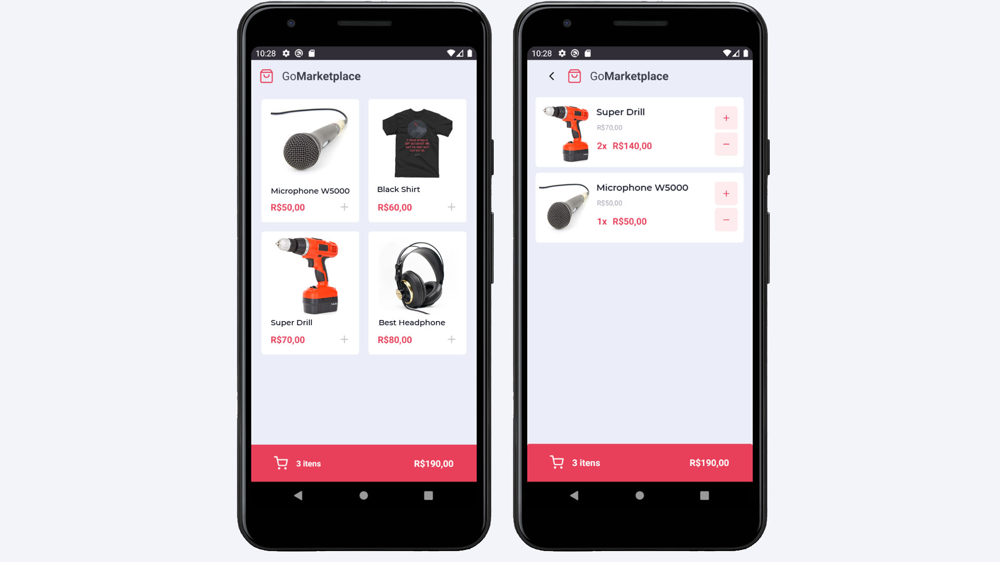

<h3 align="center">
  Challenge 08: React Native Foundations
</h3>

  

  

  

  <a href="#rocket-about-the-challenge">About the Challenge</a>&nbsp;&nbsp;&nbsp;|&nbsp;&nbsp;&nbsp;
  <a href="#memo-license">License</a>

## :rocket: About the Challenge

This was the eighth challenge for the Go-Stack Bootcamp. It involved the creation of a mobile app to simulate a e-commerce cart system. The application was built using React Native and getting data from a fake JSON API.

### Technologies
This project was developed with [React Native](https://reactnative.dev/) and [Typescript](https://www.typescriptlang.org/)

### Tests

To pass the challenge the project:

- **`should be able to list the products`**

- **`should be able to add a product to the cart`**

- **`should be able to list the products on the cart`**

- **`should be able to calculate the cart total`**

- **`should be able to show the total quantity of itens in the cart`**

- **`should be able to increment product quantity on the cart`**

- **`should be able to decrement product quantity on the cart`**

- **`should be able to navigate to the cart`**

- **`should be able to add products to the cart`**

- **`should be able to increment quantity`**

- **`should be able to decrement quantity`**

- **`should store products in AsyncStorage while adding, incrementing and decrementing`**

- **`should load products from AsyncStorage`**

## :memo: License

This project is under the MIT license. See the [LICENSE](LICENSE.md) for details.

---

Made with ♥ by Victor Alvarenga :wave: [Get in touch!](https://www.linkedin.com/in/victoralvarenga/)
